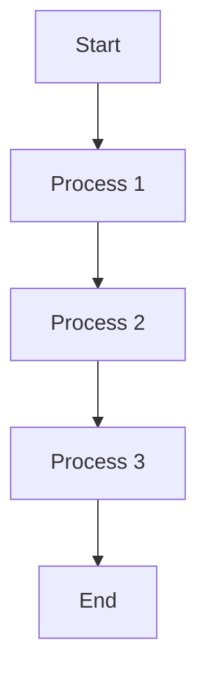

**Kode Mermaid dan Diagram**

Dalam dunia pengembangan perangkat lunak, dokumentasi adalah salah satu komponen yang sangat penting. Dokumentasi yang baik tidak hanya membantu tim pengembang untuk memahami kode yang telah ditulis, tetapi juga memudahkan mereka untuk memperbarui atau memperbaiki kode tersebut. Salah satu cara untuk membuat dokumentasi yang efektif adalah dengan menggunakan bahasa diagram seperti Kode Mermaid. Dalam artikel ini, kita akan membahas tentang Kode Mermaid dan bagaimana cara menggunakan diagram untuk membuat dokumentasi yang sederhana dan menarik.

## Apa itu Kode Mermaid?

Kode Mermaid adalah bahasa diagram yang digunakan untuk membuat diagram interaktif seperti flowchart, sequence diagram, dan class diagram. Bahasa ini dikembangkan oleh Kim Briggs dan diterbitkan di GitHub. Kode Mermaid memungkinkan pengembang untuk membuat diagram yang kompleks dengan cara yang sederhana dan mudah dipahami. Dengan menggunakan Kode Mermaid, pengembang dapat membuat dokumentasi yang lebih interaktif dan dinamis, sehingga memudahkan tim untuk memahami proses pengembangan.

## Mengapa Harus Menggunakan Kode Mermaid?

1. **Sederhana dan Mudah Dipahami**: Kode Mermaid menggunakan sintaks yang sederhana dan mudah dipahami, sehingga pengembang tidak perlu memiliki pengetahuan yang mendalam tentang bahasa diagram untuk membuat diagram yang kompleks.
2. **Interaktif**: Diagram yang dibuat dengan Kode Mermaid dapat diubah secara dinamis, sehingga memudahkan tim untuk memperbarui atau memperbaiki kode.
3. **Kompatibel dengan Berbagai Platform**: Kode Mermaid dapat diintegrasikan dengan berbagai platform seperti GitHub, GitLab, dan Jupyter Notebook, sehingga memudahkan pengembang untuk berbagi dan melihat diagram di mana saja.
4. **Dapat Dibuat Secara Online**: Pengembang dapat membuat diagram secara online menggunakan generator Kode Mermaid, sehingga tidak perlu memiliki perangkat lunak khusus untuk membuat diagram.

## Cara Menggunakan Kode Mermaid

1. **Pilih Bahasa Diagram**: Kode Mermaid mendukung berbagai jenis diagram seperti flowchart, sequence diagram, dan class diagram. Pilih jenis diagram yang paling sesuai dengan kebutuhan Anda.
2. **Buka Aplikasi/Layanan**: Buka aplikasi/layanan seperti https://www.drawio.com/
3. **Tulis Sintaks**: Tulis sintaks Kode Mermaid sesuai dengan jenis diagram yang dipilih. Contohnya, untuk membuat flowchart, Anda dapat menggunakan sintaks seperti `graph TD; A->B; B->C;`.
4. **Tambahkan Detail**: Tambahkan detail seperti label, warna, dan gaya untuk membuat diagram lebih menarik dan informatif.
5. **Simpan dan Bagikan**: Simpan kode diagram Anda dan bagikan ke tim atau komunitas pengembang lainnya.

## Contoh Penggunaan Kode Mermaid

Berikut adalah contoh penggunaan Kode Mermaid untuk membuat flowchart sederhana:

Dengan sintaks ini, kita dapat membuat flowchart yang menunjukkan proses pengembangan dari awal hingga akhir. Diagram ini dapat diubah secara dinamis untuk memperbarui proses pengembangan.

## Kesimpulan

Dalam artikel ini, kita telah membahas tentang Kode Mermaid dan bagaimana cara menggunakan diagram untuk membuat dokumentasi yang efektif. Dengan menggunakan Kode Mermaid, pengembang dapat membuat diagram yang interaktif dan sederhana, sehingga memudahkan tim untuk memahami proses pengembangan. Jika Anda ingin membuat dokumentasi yang lebih baik dan lebih menarik, pastikan untuk mencoba menggunakan Kode Mermaid dalam proyek Anda.
